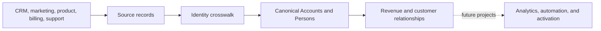

# SAI RevenueOS

[](projects/01-data-foundation/PROJECT_STATE.md)

## What Is SAI RevenueOS?

SAI RevenueOS is a learning and portfolio project that models how an enterprise business can connect its Go-To-Market (GTM) systems. It creates a consistent view of companies, people, sales opportunities, contracts, subscriptions, and customer activity across disconnected tools. The platform is designed around realistic Business-to-Business Software-as-a-Service (B2B SaaS) scenarios, but every company, person, and data example is synthetic.

The repository currently contains the completed architecture foundation for Project 1. It does not claim to be a deployed production platform.

## What Business Problem Are We Solving?

Imagine that synthetic company **Globex Health** exists as an Account in Salesforce and as a Company in HubSpot. **Sarah Kim** appears as a Salesforce Contact, a HubSpot contact, and a product user.

Without a shared identity layer, reports may count two Globex companies and three Sarahs. Sales, marketing, billing, and support teams may disagree about who the customer is.

RevenueOS gives each real-world business concept one durable canonical identity while preserving every source-system record and its history.

## How Does RevenueOS Work?



1. A source record identifies an object in one source system and tenant.
2. An external-ID crosswalk connects that record to a canonical identity when the match is known.
3. Canonical entities provide stable Accounts, Persons, Opportunities, and commercial records.
4. Effective-dated history preserves changes such as a new company name, domain, parent, or employer.
5. Future projects will use these shared identities for GTM workflows and analysis.

Start with the [beginner walkthrough](docs/START_HERE.md). Use the [glossary](docs/GLOSSARY.md) whenever a term is unfamiliar.

## The Seven Projects

| Project | Purpose | Status |
|---|---|---|
| **P1 — Data Foundation & Customer Identity** | Build shared identities, source mappings, and historical business relationships. | P1.0 and P1.1 complete; P1.2 is next |
| **P2 — Inbound** | Connect future marketing demand, scoring, and routing processes. | Planned |
| **P3 — Outbound** | Support future prospecting and outbound engagement workflows. | Planned |
| **P4 — Revenue Intelligence** | Support future pipeline, forecasting, and revenue analysis. | Planned |
| **P5 — Quote to Cash** | Connect future quoting, contracting, ordering, billing, and payment processes. | Planned |
| **P6 — Customer 360** | Create a future view of adoption, support, health, renewal, and lifecycle. | Planned |
| **P7 — Reliability** | Add future data quality, observability, recovery, and governance controls. | Planned |

## Current Progress

**Completed**

- P1.0 — Engineering and documentation foundation.
- P1.1 — Canonical business model, shared contract, Entity Relationship Diagram (ERD), eight Architecture Decision Records (ADRs), and architecture validation.
- Repository readability and learning-documentation improvement.

**In progress**

- No engineering phase is currently being implemented. P1.2 decisions are awaiting architecture approval.

**Planned next**

- P1.2 — Canonical ID Generation and External-ID Crosswalk Strategy.

See the authoritative [P1 project state](projects/01-data-foundation/PROJECT_STATE.md) for exact status and limitations.

## Repository Structure

```text
.
├── docs/
│   ├── START_HERE.md              # Guided learning path
│   ├── GLOSSARY.md                # RevenueOS terminology
│   └── MASTER_ARCHITECTURE.md     # Seven-project boundaries
├── shared/contracts/
│   └── canonical-model.v1.json    # Machine-readable shared model
└── projects/01-data-foundation/
    ├── README.md                  # P1 overview and navigation
    ├── PROJECT_STATE.md           # Current, authoritative status
    ├── DECISIONS.md               # Approved decision index
    ├── WORK_LOG.md                # Chronological evidence log
    ├── architecture/              # Model, ERD, and ADRs
    └── scripts/                   # Architecture validation
```

Future project folders are intentionally absent until they contain real work.

## How to Explore This Repository

1. [Start Here](docs/START_HERE.md) — follow one synthetic company through the model.
2. [P1 README](projects/01-data-foundation/README.md) — understand Project 1's scope.
3. [Canonical Business Model](projects/01-data-foundation/architecture/CANONICAL_BUSINESS_MODEL.md) — learn all 23 entities and the ERD.
4. [Decision Index](projects/01-data-foundation/DECISIONS.md) — see what was decided and open the ADRs to learn why.
5. [Shared Contract](shared/contracts/canonical-model.v1.json) — inspect the machine-readable technical definition.
6. [Project State](projects/01-data-foundation/PROJECT_STATE.md) — confirm what is actually working and what comes next.

## How to Verify the Current Implementation

Requirements: Python 3.9 or newer. The validator uses only the Python standard library.

```bash
python3 projects/01-data-foundation/scripts/validate_architecture.py
```

This checks the 23 entities, 31 declared relationships, approved decisions, temporal fields, ERD coverage, continuity files, and secret-like filenames.

## Important Limitations

- The current deliverable is a logical architecture, not a deployed data platform.
- There is no production Snowflake schema, ingestion pipeline, identity-matching engine, survivorship engine, reverse Extract-Transform-Load (ETL), or workflow service.
- The shared JSON contract describes intended meaning and relationships; it does not prove that source data has been loaded.
- P2–P7 are planned boundaries, not implemented capabilities.

Repository: [BsdSaiPrasad/sai-revenueos](https://github.com/BsdSaiPrasad/sai-revenueos)
