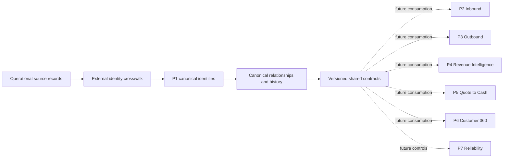

# SAI RevenueOS Master Architecture

## Purpose and boundaries

SAI RevenueOS is a portfolio-grade synthetic B2B SaaS revenue platform divided into seven bounded projects. Project 1 owns canonical customer and revenue identities plus the shared logical contracts that downstream projects consume. This document records the boundary; it does not design P2–P7.

| Project | Responsibility | Current repository status |
|---|---|---|
| P1 — Data Foundation & Customer Identity | Canonical entities, external identity linkage, history, provenance, and future activation foundations | P1.0 and P1.1 implemented |
| P2 — Inbound | Future inbound demand capabilities | Not implemented |
| P3 — Outbound | Future outbound capabilities | Not implemented |
| P4 — Revenue Intelligence | Future forecasting and revenue analytics | Not implemented |
| P5 — Quote to Cash | Future commercial transaction workflows | Not implemented |
| P6 — Customer 360 | Future customer health and lifecycle experiences | Not implemented |
| P7 — Reliability | Future observability and operational controls | Not implemented |

## Architectural flow

P1 separates immutable canonical identifiers from mutable business attributes. Source records remain traceable through an auditable crosswalk. Time-varying names, domains, hierarchies, and employment affiliations are modeled explicitly rather than overwriting prior state.

## Contract ownership

Cross-project contracts live in `shared/contracts/`; project-local documents explain and govern them but must not redefine incompatible copies. Contract versions use an explicit major version. Breaking changes require a new major version and review of all downstream consumers.

The current contract, `canonical-model.v1.json`, is a logical architecture contract rather than a physical warehouse schema. It defines entity identity, ownership, history behavior, and relationship cardinality. Warehouse-specific types, clustering, ingestion metadata, and dbt models are deferred.

## Platform invariants

1. Canonical identity is stable and source-independent.
2. A human is represented once as a Person even when their employer or source-system object changes.
3. Parent and subsidiary Accounts retain distinct identities and explicit time-bound relationships.
4. Lead and Contact are source records, never alternate canonical Person tables.
5. Every Opportunity has exactly one primary buying Account; participants use OpportunityPersonRole.
6. Customer is Account lifecycle state, not a duplicate business entity.
7. Commercial objects (Quote, Contract, Order, Subscription, Invoice) retain independent identities.
8. Source-to-canonical mappings are auditable, effective-dated, and correctable.
9. Unresolved source records and interactions remain preservable without inventing canonical matches.
10. Raw sensitive attributes and access controls will be designed before physical ingestion; no real customer data belongs in this repository.

## Approved decisions

The eight approved P1 decisions are indexed in [`DECISIONS.md`](../projects/01-data-foundation/DECISIONS.md) and recorded as ADRs. Changes affecting other project boundaries must be raised as **MASTER ARCHITECTURE DECISION NEEDED** rather than introduced silently.

## Current limitations

P1.0/P1.1 define and validate the logical model only. They do not implement a Snowflake schema, source ingestion, identity matching, survivorship, reconciliation jobs, security policies, dbt transformations, reverse ETL, or downstream workflows. Those capabilities require later phases and explicit operational decisions.
