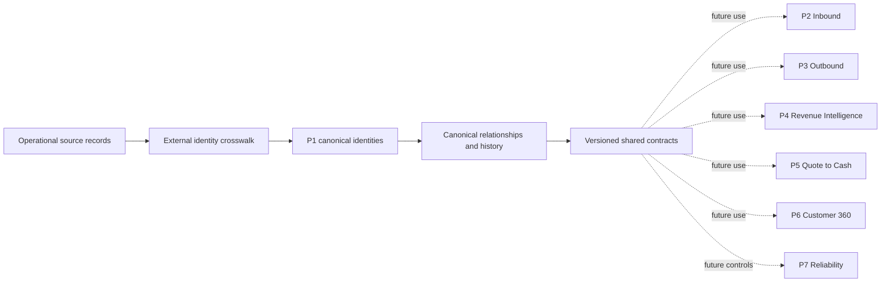

# SAI RevenueOS Master Architecture

## What Is This Document?

This document defines the boundaries of the seven SAI RevenueOS projects. It explains what each project is responsible for and prevents one project from silently redesigning another.

For a guided business example, read [Start Here](START_HERE.md). For terminology, use the [glossary](GLOSSARY.md).

## Why Split RevenueOS Into Projects?

A Revenue Operations (RevOps) platform connects many concerns: customer identity, marketing, sales, contracts, billing, product use, support, automation, and reliability. Building them as one undefined system would make ownership and dependencies hard to explain.

The seven-project structure gives each concern a clear home. Shared definitions still come from Project 1 so that later projects do not invent conflicting Accounts, Persons, or Opportunities.

## How Data Will Flow

Example: synthetic company Globex Health can appear in Salesforce and HubSpot. P1 preserves both source records, connects them to one canonical Account when resolved, and publishes a shared contract. Future projects will use that Account rather than creating their own company identities.

## The Seven Project Boundaries

| Project | What it owns | Current status |
|---|---|---|
| **P1 — Data Foundation & Customer Identity** | Canonical entities, source identity, historical relationships, provenance, and shared data contracts. | P1.0 and P1.1 complete |
| **P2 — Inbound** | Future inbound demand capture, scoring, and routing. | Planned |
| **P3 — Outbound** | Future prospecting, sequencing, and outbound engagement. | Planned |
| **P4 — Revenue Intelligence** | Future pipeline, forecasting, and revenue analytics. | Planned |
| **P5 — Quote to Cash** | Future quoting, contracts, orders, billing, and commercial workflows. | Planned |
| **P6 — Customer 360** | Future product adoption, support, customer health, and renewal views. | Planned |
| **P7 — Reliability** | Future data quality, monitoring, recovery, and governance controls. | Planned |

## What P1 Publishes

P1 owns the shared logical model in `shared/contracts/canonical-model.v1.json`. Other projects may map that contract into warehouse tables, Application Programming Interfaces (APIs), events, or semantic models, but they must not create incompatible definitions inside their own folders.

A breaking change—such as changing what an Account ID means—requires a new major contract version and a review of every downstream project. If work reveals a cross-project change, label it **MASTER ARCHITECTURE DECISION NEEDED** before implementation.

## Architecture Rules That Must Remain True

1. Canonical IDs are stable and independent of source-system IDs.
2. One human is one Person even when source records or employers change.
3. Parent and subsidiary Accounts remain separate and use explicit hierarchy relationships.
4. Lead and Contact are source-system records, not alternative Person entities.
5. Every Opportunity has one primary buying Account; people join through OpportunityPersonRole.
6. Customer is an Account lifecycle status, not a duplicate company entity.
7. Quote, Contract, Order, Subscription, and Invoice keep their own identities.
8. Activity, Campaign, and ProductUser are different concepts.
9. Source-to-canonical mappings are auditable, effective-dated, and correctable.
10. Unresolved records remain available without inventing a match.

The reasoning is recorded in the [P1 decision index](../projects/01-data-foundation/DECISIONS.md).

## What Could Go Wrong?

- A later project could copy the contract and change its meaning locally.
- Documentation could describe a planned system as already running.
- A source-system identifier could accidentally become a canonical ID.
- A correction could overwrite history instead of preserving evidence.
- Real customer or credential data could be committed to this synthetic project.

Repository validation catches structural drift, but future physical systems will also need security, reconciliation, and operational controls.

## What Comes Next?

The next engineering milestone remains **P1.2 — Canonical ID Generation and External-ID Crosswalk Strategy**. Its architecture choices must be approved before implementation. P2–P7 stay planned until their own work begins.
